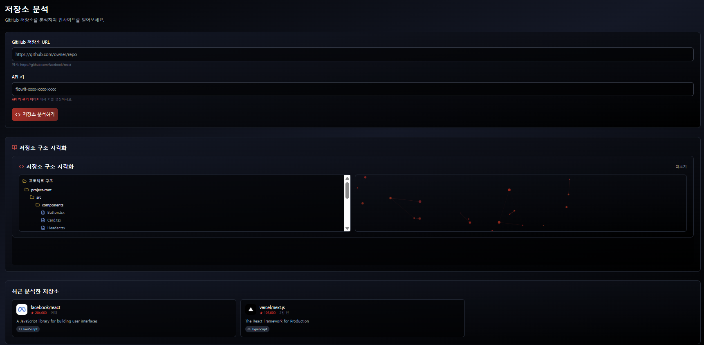
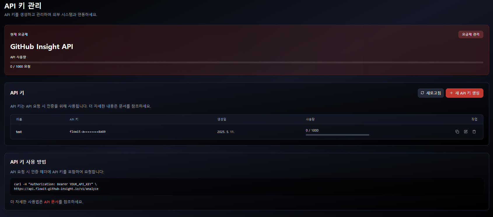
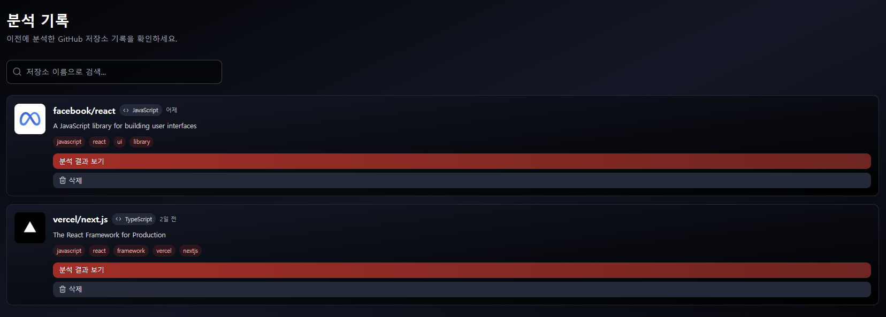
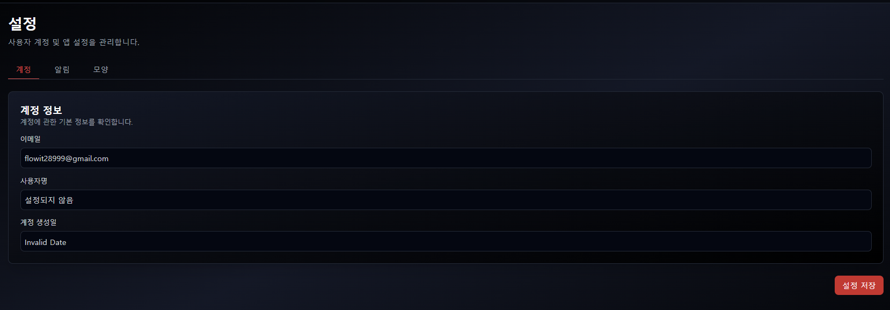
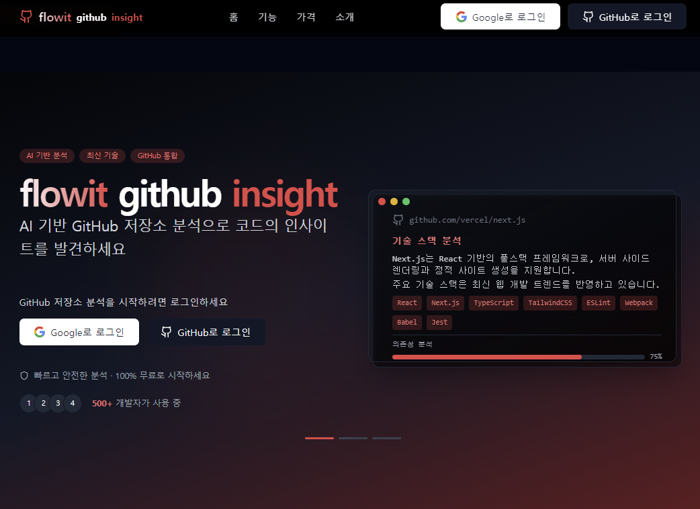

# Flowit GitHub Insight - Vibe Coding SAAS

<div align="center">

**GitHub 저장소 분석을 통해 유용한 인사이트를 제공하는 AI 기반 웹 애플리케이션**
<p align="center">
  
</p>


[](https://nextjs.org/)
[](https://reactjs.org/)
[](https://tailwindcss.com/)
[](https://supabase.io/)
[](https://openai.com/)

</div>

## 📋 목차

- [서비스 개요](#-서비스-개요)
- [주요 기능](#-주요-기능)
- [기술 스택](#-기술-스택)
- [아키텍처](#-아키텍처)
- [구현 상세](#-구현-상세)
- [설치 및 설정](#-설치-및-설정)
- [API 사용 예시](#-api-사용-예시)

## 🚀 서비스 개요

**Flowit GitHub Insight**는 GitHub 저장소를 AI로 분석하여 개발자와 학습자에게 중요한 인사이트를 제공하는 SaaS 플랫폼입니다. 저장소의 목적, 주요 기능, 아키텍처, 코드 품질, 학습 난이도 등을 종합적으로 분석하여 다음과 같은 질문에 답해줍니다:

- 이 프로젝트는 무슨 문제를 해결하기 위해 만들어졌나요?
- 핵심 기능과 사용된 기술 스택은 무엇인가요?
- 이 프로젝트를 학습하거나 기여하기에 적합한가요?
- 코드 구조와 아키텍처는 어떻게 설계되어 있나요?

개발자, 학습자, 채용 담당자 등이 GitHub 저장소를 빠르게 이해하고 가치를 평가할 수 있도록 도와줍니다.

## ✨ 주요 기능

### 1. GitHub 저장소 분석




- **AI 기반 코드 분석**: 저장소의 코드, README, 이슈, PR 등을 종합적으로 분석
- **다각도 인사이트**: 프로젝트 목적, 구조, 기술 스택, 학습 난이도 등 다각도 평가
- **시각화**: 저장소 구조 및 코드 의존성을 3D 시각화로 제공
- **사용자 친화적 인터페이스**: 직관적인 UI와 상세한 분석 보고서

### 2. API 키 관리



- **API 키 생성**: 외부 서비스 연동을 위한 고유 API 키 생성
- **권한 관리**: 키별 사용 권한 및 제한 설정
- **사용량 추적**: API 키별 사용 이력 및 통계 확인
- **보안 강화**: 암호화 저장 및 보안 처리

### 3. 분석 이력 관리



- **분석 결과 저장**: 모든 분석 결과를 사용자별로 저장 및 관리
- **이력 조회**: 날짜, 저장소, 분석 유형 등으로 검색 및 필터링
- **비교 기능**: 동일 저장소의 시간별 변화 비교 분석
- **공유 기능**: 분석 결과 공유 및 협업 지원

### 4. 사용자 설정 관리



- **계정 관리**: 사용자 프로필 및 계정 정보 관리
- **알림 설정**: 이메일 알림 및 주간 리포트 설정
- **테마 설정**: 다크 모드 등 사용자 인터페이스 커스터마이징
- **언어 설정**: 다국어 지원 (현재 한국어 지원)

### 5. 사용자 인증



- **소셜 로그인**: Google, GitHub 계정을 통한 간편 로그인
- **보안 강화**: JWT 기반 안전한 인증 시스템
- **권한 관리**: 사용자 역할 및 권한 체계 구현
- **세션 관리**: 안전한 세션 처리 및 갱신 메커니즘

## 🛠 기술 스택

### 프론트엔드
- **Next.js 14**: 서버 사이드 렌더링(SSR) 및 정적 사이트 생성(SSG) 활용
- **React 18**: 함수형 컴포넌트 및 React Hooks 기반 UI 구현
- **TailwindCSS**: 유틸리티 클래스 기반 반응형 디자인 구현
- **Lucide Icons**: 모던한 아이콘 시스템 활용
- **Custom Components**: 재사용 가능한 UI 컴포넌트 설계

### 백엔드
- **Next.js API Routes**: 서버리스 함수 기반 API 구현
- **LangChain**: AI 모델과의 연동 및 복잡한 프롬프트 처리
- **RESTful API**: 명확한 엔드포인트 및 상태 코드 설계
- **미들웨어**: 인증, 로깅, 에러 처리 등 공통 기능 구현

### 인증
- **NextAuth.js**: 다중 인증 제공자 지원 및 세션 관리
- **OAuth 2.0**: Google 소셜 로그인 구현
- **JWT**: 안전한 토큰 기반 인증 시스템
- **Supabase Auth**: 데이터베이스 연동 사용자 관리 시스템

### 데이터베이스
- **Supabase (PostgreSQL)**: 클라우드 기반 관계형 데이터베이스
- **효율적인 스키마 설계**: 정규화된 테이블 구조 및 인덱싱
- **Row Level Security (RLS)**: 데이터 접근 제어 보안 정책
- **실시간 구독**: WebSocket 기반 데이터 동기화

### AI 및 분석
- **OpenAI GPT**: 고급 자연어 처리 및 코드 분석
- **LangChain**: AI 체인 및 에이전트 구현
- **GitHub API 연동**: 저장소 메타데이터 및 코드 접근
- **데이터 시각화**: 3D 시각화 및 데이터 그래프 구현

## 🏗 아키텍처

Flowit GitHub Insight는 현대적인 클라우드 네이티브 아키텍처를 기반으로 구축되었습니다.

```
┌───────────────────────────┐      ┌───────────────────────────┐
│     Client (Browser)      │      │      Next.js Server       │
│                           │      │                           │
│  ┌───────────────────┐   │      │  ┌───────────────────┐    │
│  │  React Components │◄──┼──────┼─►│   API Routes      │    │
│  └───────────────────┘   │      │  └─────────┬─────────┘    │
│  ┌───────────────────┐   │      │  ┌─────────▼─────────┐    │
│  │  State Management │   │      │  │  Business Logic   │    │
│  └───────────────────┘   │      │  └─────────┬─────────┘    │
└───────────────────────────┘      └───────────┬───────────────┘
                                             ┌─▼───┐
                                  ┌──────────┤ API ├──────────┐
                                  │          └─────┘          │
                                  │                           │
                ┌─────────────────▼───┐               ┌───────▼─────────┐
                │                     │               │                 │
                │  OpenAI API         │               │  Supabase       │
                │  (GPT 모델)         │               │  (Auth/DB)      │
                └─────────────────────┘               └─────────────────┘
```

## 📝 구현 상세

### 1. 반응형 대시보드 구현

대시보드는 사용자에게 중요한 기능에 빠르게 접근할 수 있는 허브로 설계되었습니다. TailwindCSS를 활용하여 다양한 화면 크기에 최적화된 반응형 레이아웃을 구현했습니다.

```tsx
// 주요 코드 구현
<div className="grid grid-cols-1 md:grid-cols-2 lg:grid-cols-4 gap-5 mb-8">
  {/* API 키 관리, 저장소 분석, 분석 기록, 설정 카드 */}
</div>
```

### 2. 커스텀 토스트 알림 시스템

UX를 개선하기 위해 외부 라이브러리에 의존하지 않는 커스텀 토스트 알림 시스템을 구현했습니다. React의 상태 관리와 CSS 애니메이션을 활용하여 경량화된 알림 컴포넌트를 개발했습니다.

```tsx
function Toast({ message, type, onClose }) {
  useEffect(() => {
    const timer = setTimeout(() => onClose(), 3000);
    return () => clearTimeout(timer);
  }, [onClose]);
  
  return (
    <div className={`fixed top-4 right-4 z-50 ${type === 'success' ? 'bg-green-600' : 'bg-red-600'}`}>
      {/* 토스트 UI */}
    </div>
  );
}
```

### 3. 컨텍스트 기반 인증 시스템

Next.js와 React Context API를 활용하여 사용자 인증 상태를 전역적으로 관리하는 시스템을 구현했습니다. Supabase와 NextAuth.js를 통합하여 다중 인증 제공자를 지원합니다.

```tsx
// AuthContext.tsx
const AuthContext = createContext<AuthContextType>({
  user: null,
  loading: true,
  signOut: async () => {},
  updateUserMetadata: async () => {},
});

export function AuthProvider({ children }) {
  // 인증 로직 구현
}
```

### 4. 사용자 메타데이터 관리

사용자의 설정 및 기본 설정을 관리하기 위한 메타데이터 시스템을 구현했습니다. Supabase의 사용자 메타데이터 필드를 활용하여 클라이언트와 서버 간의 상태 동기화를 구현했습니다.

```tsx
const updateUserMetadata = async (metadata: Record<string, any>) => {
  try {
    if (user && user.id !== 'nextauth-user') {
      const { data, error } = await supabase.auth.updateUser({
        data: { ...metadata }
      });
      
      if (error) throw error;
      if (data.user) setUser(data.user);
    } else if (user && user.id === 'nextauth-user') {
      // NextAuth 사용자 처리
    }
  } catch (error) {
    console.error('사용자 메타데이터 업데이트 중 에러:', error);
    throw error;
  }
};
```

### 5. 저장소 분석 워크플로우

GitHub 저장소를 분석하기 위한 체계적인 워크플로우를 구현했습니다. 사용자 입력 검증, API 요청 처리, 토스트 알림, 페이지 리디렉션 등을 포함한 전체 흐름을 최적화했습니다.

```tsx
const handleAnalyze = async (e: React.FormEvent) => {
  e.preventDefault();
  
  // 입력 검증
  if (!isValidRepoUrl(repoUrl)) {
    showNotification('유효한 GitHub 저장소 URL이 아닙니다.', 'error');
    return;
  }
  
  try {
    setIsAnalyzing(true);
    // API 요청 및 결과 처리
    // ...
    
    // 토스트 알림 및 리디렉션
    showNotification('분석이 완료되었습니다!', 'success');
    setTimeout(() => {
      router.push(`/dashboard/results/${owner}/${repo}`);
    }, 3000);
  } catch (error) {
    // 오류 처리
  }
};
```

## 🔧 설치 및 설정

### 필요 조건

- Node.js (18.0.0 이상)
- Supabase 계정
- OpenAI API 키
- Google Cloud Console에서 OAuth 클라이언트 ID/Secret
- (선택사항) GitHub 개인 액세스 토큰

### 설치 단계

1. 저장소 클론

```bash
git clone https://github.com/yourusername/flowit-github-insight.git
cd flowit-github-insight
```

2. 의존성 설치

```bash
npm install
```

3. 환경 변수 설정

`env.example` 파일을 `.env.local`로 복사하고 필요한 값을 입력합니다.

```bash
cp env.example .env.local
```

`.env.local` 파일을 편집하여 다음 값을 입력합니다:
- `NEXTAUTH_SECRET`: 랜덤 문자열 (보안 토큰 생성용)
- `GOOGLE_CLIENT_ID`, `GOOGLE_CLIENT_SECRET`: Google OAuth 인증 정보
- `NEXT_PUBLIC_SUPABASE_URL`, `NEXT_PUBLIC_SUPABASE_ANON_KEY`: Supabase 연결 정보
- `OPENAI_API_KEY`: OpenAI API 접근 키
- `GITHUB_TOKEN`: GitHub API 접근용 (선택 사항)

4. Supabase 데이터베이스 설정

Supabase 프로젝트를 생성하고 `supabase/migrations` 폴더의 SQL 스크립트를 실행하여 필요한 테이블을 생성합니다.

Supabase UI에서 SQL 편집기를 열고 마이그레이션 스크립트를 실행합니다:

```sql
-- 사용자 API 키 테이블
CREATE TABLE api_keys (
  id UUID PRIMARY KEY DEFAULT uuid_generate_v4(),
  user_id UUID REFERENCES auth.users(id) ON DELETE CASCADE,
  key TEXT NOT NULL,
  name TEXT,
  created_at TIMESTAMP WITH TIME ZONE DEFAULT NOW(),
  expires_at TIMESTAMP WITH TIME ZONE,
  last_used_at TIMESTAMP WITH TIME ZONE
);

-- 저장소 분석 결과 테이블
CREATE TABLE repository_analyses (
  id UUID PRIMARY KEY DEFAULT uuid_generate_v4(),
  user_id UUID REFERENCES auth.users(id) ON DELETE CASCADE,
  repo_owner TEXT NOT NULL,
  repo_name TEXT NOT NULL,
  analysis JSONB NOT NULL,
  created_at TIMESTAMP WITH TIME ZONE DEFAULT NOW()
);

-- RLS 정책 설정
ALTER TABLE api_keys ENABLE ROW LEVEL SECURITY;
ALTER TABLE repository_analyses ENABLE ROW LEVEL SECURITY;

-- 사용자는 자신의 API 키만 접근 가능
CREATE POLICY "Users can only access their own API keys"
ON api_keys FOR ALL USING (auth.uid() = user_id);

-- 사용자는 자신의 분석 결과만 접근 가능
CREATE POLICY "Users can only access their own analyses"
ON repository_analyses FOR ALL USING (auth.uid() = user_id);
```

5. 개발 서버 실행

```bash
npm run dev
```

브라우저에서 `http://localhost:3000`으로 접속하여 앱을 확인할 수 있습니다.

## 📡 API 사용 예시

### GitHub 저장소 분석 API

```javascript
// 저장소 분석 요청
const response = await fetch('/api/analyze-repository', {
  method: 'POST',
  headers: {
    'Content-Type': 'application/json',
    'X-API-Key': 'flowit-xxxx-xxxx-xxxx'
  },
  body: JSON.stringify({
    url: 'https://github.com/owner/repo'
  })
});

const data = await response.json();
console.log(data.analysis); // 분석 결과
```

### 사용자 설정 API

```javascript
// 사용자 설정 업데이트
const response = await fetch('/api/user/settings', {
  method: 'PUT',
  headers: {
    'Content-Type': 'application/json'
  },
  body: JSON.stringify({
    emailNotifications: true,
    weeklyReport: false,
    language: 'ko'
  })
});

const data = await response.json();
console.log(data.message); // "설정이 성공적으로 업데이트되었습니다."
```


